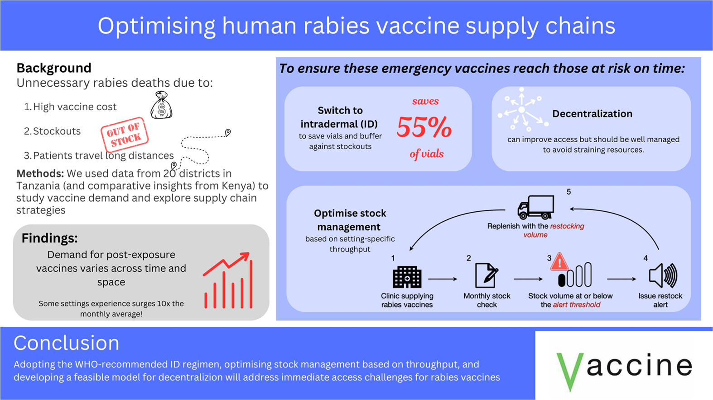

## **"Optimising human rabies vaccine supply chains: a modelling study"**

---

## **Background**
Rabies remains a critical public health issue in low- and middle-income countries (LMICs), causing thousands of preventable deaths annually. Despite the availability of effective vaccines for post-exposure prophylaxis (PEP), their high costs and frequent supply chain failures lead to stockouts, particularly in resource-constrained settings. Gavi, the Vaccine Alliance, has pledged investment to improve PEP access in LMICs. This work evaluates PEP demand dynamics and identifies robust stock management strategies tailored for Gavi-eligible countries.

---

## **Objectives**
1. Evaluate **PEP demand** using real-world bite patient data.
2. Assess post-exposure vaccine use under WHO-recommended **IM** (intramuscular) and **ID** (intradermal) regimens.
3. Simulate stock management strategies to identify approaches that improve supply chain resilience and minimise stockouts.
4. Investigate the impact of decentralising PEP distribution to more health facilities.

---

## **Data**
- **Tanzania**: Five years of Integrated Bite Case Management (IBCM) data across 20 districts.
- **Kenya**: National bite patient data across 47 counties.

---

## **Methods**
1. **Demand Simulation**:  
   - Fitted **negative binomial distributions** to patient data to capture variability in bite incidence.
   - Simulated monthly PEP demand across districts and counties using estimated mean and dispersion parameters.  
   - Examined surge factors and their dynamics

2. **Vaccine Regimens**:  
   - Compared vial use under two WHO-recommended regimens:  
     - **Intramuscular (IM)**: 4-dose regimen (Days 0, 3, 7, 14).  
     - **Intradermal (ID)**: Abridged 1-week regimen (Days 0, 3, 7).  

3. **Stock Management**:  
   - Evaluated stockout risks under varying stock management strategies.  
   - Simulated alert thresholds and restocking volumes to match health facility throughput.  

4. **Decentralisation Analysis**:  
   - Modelled PEP availability when decentralised to ward-level facilities.  
   - Measured the trade-off between improved access and reduced vial-sharing opportunities.  

---

## **Running the code**
Order of scripts (written using R version 4.4.2):

1. "./scripts/ibcm_vial_use.R" (this runs data_filtering.R, HelperFun.R & decentralization.R)
2. "./scripts/stockouts.R" // "./scripts/vial_use_by_bites_model.R" // "./scripts/Kenyan_data.R"

//  either of these scripts can be run after those in number 1

---

## **Citation**
Luka MM, Ferguson EA, Rees E, Hoffu H, Changalucha J, Lushasi K, Sikana L, Mutunga M, Thumbi SM, Hampson K. Optimising human rabies vaccine supply chains: a modelling study, [_Vaccine_ (2025)](https://www.sciencedirect.com/science/article/pii/S0264410X25004050).

